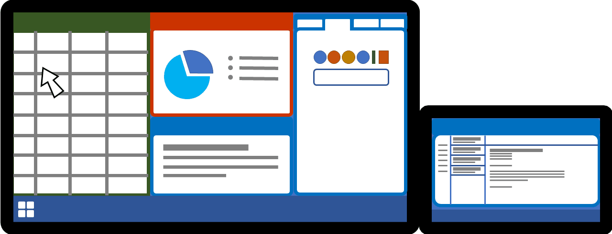

----
## 2025-04-18 Update

A modified version of FancyMouse is now incorporated into Microsoft [PowerToys](https://github.com/microsoft/PowerToys) and renamed "Mouse Jump".

I'll continue to maintain the FancyMouse repo as an incubator, and new features will arrive here first before being submitted to PowerToys into their review process.

----

## Overview

FancyMouse is a Windows utility for quickly moving the mouse large distances on high-res desktops.

See links for additional details:

* [Basic Configuration](./wiki/config/basic_config.md)
* [Advanced Configuration](./wiki/config/advanced_config.md)

---

## The Problem

On a modern laptop that uses an Ultra-Wide external monitor you could easily have a desktop in the region of 8000+ pixels wide, and that's a lot of ground for your mouse to cover.

What tends to happen is you end up swiping the physical mouse as far as it will go, then lifting, moving back to the start and swiping again - sometimes half a dozen times just to get to the other side of the screen. During this process you quite often lose track of where the mouse is and spend precious seconds trying to find it again.

FancyMouse helps by letting you click a scaled-down preview of your entire desktop and "teleport" the mouse there in an instant.

---

## Swiping

Here's an animation showing the old slow way of swiping the mouse multiple times.

Imagine you're happily working on a spreadsheet on your ultra-wide external monitor you get a notification of a new email arriving on your laptop's screen. They're opposite ends of the desktop and several thousand pixels away so you start swiping the mouse repeatedly...

---

## FancyMouse

And here's the same thing using FancyMouse. A hotkey or spare mouse button can be configured to activate the FancyMouse popup, and the pointer only needs to be moved a tiny amount on the preview thumbnail. A single mouse click then teleports the pointer to that location on the full-size desktop.

The visual cue tells you exactly where the pointer will end up so you can find it easily without needing to search for it.

and here's a video of it in action:

https://user-images.githubusercontent.com/1193763/217108881-5e8a983a-2058-43e4-a3f4-655281ef7d68.mp4
