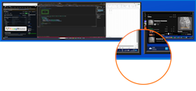
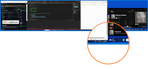
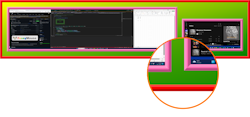

# Advanced Config

**FancyMouse** supports a set of style and layout configuration settings that follow a simplified version of the [W3C Box Model](https://www.w3.org/TR/CSS2/box.html). These can be used to configure the spacing and appearance of elements in the preview popup, for example:

```
    +--------------[bounds]---------------+
    |▒▒▒▒▒▒▒▒▒▒▒▒▒▒[margin]▒▒▒▒▒▒▒▒▒▒▒▒▒▒▒|
    |▒▒▓▓▓▓▓▓▓▓▓▓▓▓[border]▓▓▓▓▓▓▓▓▓▓▓▓▓▒▒|
    |▒▒▓▓░░░░░░░░░░[padding]░░░░░░░░░░▓▓▒▒|
    |▒▒▓▓░░                         ░░▓▓▒▒|
    |▒▒▓▓░░                         ░░▓▓▒▒|
    |▒▒▓▓░░        [content]        ░░▓▓▒▒|
    |▒▒▓▓░░                         ░░▓▓▒▒|
    |▒▒▓▓░░                         ░░▓▓▒▒|
    |▒▒▓▓░░░░░░░░░░░░░░░░░░░░░░░░░░░░░▓▓▒▒|
    |▒▒▓▓▓▓▓▓▓▓▓▓▓▓▓▓▓▓▓▓▓▓▓▓▓▓▓▓▓▓▓▓▓▓▓▒▒|
    |▒▒▒▒▒▒▒▒▒▒▒▒▒▒▒▒▒▒▒▒▒▒▒▒▒▒▒▒▒▒▒▒▒▒▒▒▒|
    +-------------------------------------+
```


* **margin** - the size of the gap between the outer boundary of the element and the border
* **border** - the thickness and colour of the border around the element
* **padding** - the size of the gap between the border and the content
* **content** - the area at the center of the element that can contain child elements

There are two sets of box configurations that can be customised - one for the main pewview popup canvas, and one for the miniature screenshots. These can be combined to make a variety of effects.

## Gallery

If you just want to dive into some examples to see how it works, here's some pre-made config files that you can experiment with...

| Preview | Name | Description |
| ------- | ---- | ----------- |
|  | **[Default](./default_v2_config.md)** | The current default preview style
|  | **[Legacy](./legacy_v1_config.md)** | Config settings that emulate the legacy preview style
|  | **[Gaudy](./gaudy_v2_config.md)** | A ghastly assaault on the eyes

> **Note:** If you design an interesting style feel free to share it by raising an [issue](https://github.com/mikeclayton/FancyMouse/issues) with a screenshot and the contents of the config file and I'll and some of them to this gallery.

## Reference

The table below annotates a sample config file, but check out one of the gallery links above for a cut & pasteable version that you can copy into your own config file.

| Key | Description |
| --- | ----------- |
| ```{``` |
| &nbsp;&nbsp;&nbsp;&nbsp;```"version": 2,``` | Indicates the **version** of the config file format used in this file. DIfferent versions will support different settings and this is used where possible to read old formats and apply them to the application's behaviour and visual style.
| &nbsp;&nbsp;&nbsp;&nbsp;```"hotkey": "CTRL + ALT + SHIFT + F",``` | The key combination that activates the preview popup. You can potentially bind this combination to spare button on your mouse if your manufacturer's softwatr supports it to make it easier to trigger.
| &nbsp;&nbsp;&nbsp;&nbsp;```"preview: {``` |
| &nbsp;&nbsp;&nbsp;&nbsp;&nbsp;&nbsp;&nbsp;&nbsp;```"name": "default",``` | Specifies an arbitray **name** for the style in this config file to make it easier to distinguish it when comparing to other config files.
| &nbsp;&nbsp;&nbsp;&nbsp;&nbsp;&nbsp;&nbsp;&nbsp;```"size": {``` |
| &nbsp;&nbsp;&nbsp;&nbsp;&nbsp;&nbsp;&nbsp;&nbsp;&nbsp;&nbsp;&nbsp;&nbsp;```"width": 1600,``` | The maximum **width** in pixels of the preview popup. The actual popup width may be smaller depending on the aspect ratio of the entire screen, and / or the size of the monitor the preview popup is activated on.
| &nbsp;&nbsp;&nbsp;&nbsp;&nbsp;&nbsp;&nbsp;&nbsp;&nbsp;&nbsp;&nbsp;&nbsp;```"height": 1200``` |  The maximum **height** in pixels of the preview popup. The actual popup height may be smaller depending on the aspect ratio of the entire screen, and / or the size of the monitor the preview popup is activated on.
| &nbsp;&nbsp;&nbsp;&nbsp;&nbsp;&nbsp;&nbsp;&nbsp;```},``` |
| &nbsp;&nbsp;&nbsp;&nbsp;&nbsp;&nbsp;&nbsp;&nbsp;```"canvas": {``` | Contains style settings that define the visual appearance of the main **preview popup** window (as opposed to the screenshot thumbnails). This is called the ```canvas``` for the sake of gving it a unique name that isn't heavily overloaded elsewhere (e.g. ```preview```).
| &nbsp;&nbsp;&nbsp;&nbsp;&nbsp;&nbsp;&nbsp;&nbsp;&nbsp;&nbsp;&nbsp;&nbsp;```"border": {``` |
| &nbsp;&nbsp;&nbsp;&nbsp;&nbsp;&nbsp;&nbsp;&nbsp;&nbsp;&nbsp;&nbsp;&nbsp;&nbsp;&nbsp;&nbsp;&nbsp;```"color": "SystemColors.Highlight",``` | The **color** of the border around the ```canvas```. See below for the format of valid ```color``` strings.
| &nbsp;&nbsp;&nbsp;&nbsp;&nbsp;&nbsp;&nbsp;&nbsp;&nbsp;&nbsp;&nbsp;&nbsp;&nbsp;&nbsp;&nbsp;&nbsp;```"width": 6,``` | The **width** in pixels of the border around the ```canvas```.
| &nbsp;&nbsp;&nbsp;&nbsp;&nbsp;&nbsp;&nbsp;&nbsp;&nbsp;&nbsp;&nbsp;&nbsp;&nbsp;&nbsp;&nbsp;&nbsp;```"depth": 0``` | The **depth** (i.e. thickness in pixels) of the 3D highlight and shadow effect on the border around the ```canvas```.
| &nbsp;&nbsp;&nbsp;&nbsp;&nbsp;&nbsp;&nbsp;&nbsp;&nbsp;&nbsp;&nbsp;&nbsp;```},``` |
| &nbsp;&nbsp;&nbsp;&nbsp;&nbsp;&nbsp;&nbsp;&nbsp;&nbsp;&nbsp;&nbsp;&nbsp;```"padding": {``` |
| &nbsp;&nbsp;&nbsp;&nbsp;&nbsp;&nbsp;&nbsp;&nbsp;&nbsp;&nbsp;&nbsp;&nbsp;&nbsp;&nbsp;&nbsp;&nbsp;```"width": 6``` | The **width** in pixels of the spacing between the ```canvas``` border and the boundaries of the screenshot boxes.
| &nbsp;&nbsp;&nbsp;&nbsp;&nbsp;&nbsp;&nbsp;&nbsp;&nbsp;&nbsp;&nbsp;&nbsp;```},``` |
| &nbsp;&nbsp;&nbsp;&nbsp;&nbsp;&nbsp;&nbsp;&nbsp;&nbsp;&nbsp;&nbsp;&nbsp;```"background": {``` |
| &nbsp;&nbsp;&nbsp;&nbsp;&nbsp;&nbsp;&nbsp;&nbsp;&nbsp;&nbsp;&nbsp;&nbsp;&nbsp;&nbsp;&nbsp;&nbsp;```"color1": "#0D57D2",``` | The **primary color** of the background gradient fill drawn on visible parts of the ```canvas``` - e.g. the padding area, or the margin on screenshot boxes.  See below for the format of valid ```color``` strings.
| &nbsp;&nbsp;&nbsp;&nbsp;&nbsp;&nbsp;&nbsp;&nbsp;&nbsp;&nbsp;&nbsp;&nbsp;&nbsp;&nbsp;&nbsp;&nbsp;```"color2": "#0344C0"``` | The **secondary color** of the background gradient fill drawn on visible parts of the ```canvas``` - e.g. the padding area, or the margin on screenshot boxes.  See below for the format of valid ```color``` strings.
| &nbsp;&nbsp;&nbsp;&nbsp;&nbsp;&nbsp;&nbsp;&nbsp;&nbsp;&nbsp;&nbsp;&nbsp;```}``` |
| &nbsp;&nbsp;&nbsp;&nbsp;&nbsp;&nbsp;&nbsp;&nbsp;```},``` |
| &nbsp;&nbsp;&nbsp;&nbsp;&nbsp;&nbsp;&nbsp;&nbsp;```"screenshot": {``` | Contains style settings that define the visual appearance of the **screenshot** boxes on the preview popup window.
| &nbsp;&nbsp;&nbsp;&nbsp;&nbsp;&nbsp;&nbsp;&nbsp;&nbsp;&nbsp;&nbsp;&nbsp;```"margin": {``` |
| &nbsp;&nbsp;&nbsp;&nbsp;&nbsp;&nbsp;&nbsp;&nbsp;&nbsp;&nbsp;&nbsp;&nbsp;&nbsp;&nbsp;&nbsp;&nbsp;```"width": 2``` | The **width** of the margin around each screenshot box.
| &nbsp;&nbsp;&nbsp;&nbsp;&nbsp;&nbsp;&nbsp;&nbsp;&nbsp;&nbsp;&nbsp;&nbsp;```},``` |
| &nbsp;&nbsp;&nbsp;&nbsp;&nbsp;&nbsp;&nbsp;&nbsp;&nbsp;&nbsp;&nbsp;&nbsp;```"border": {``` |
| &nbsp;&nbsp;&nbsp;&nbsp;&nbsp;&nbsp;&nbsp;&nbsp;&nbsp;&nbsp;&nbsp;&nbsp;&nbsp;&nbsp;&nbsp;&nbsp;```"color": "#222222",``` | The **color** of the border around each screenshot box. See below for the format of valid ```color``` strings.
| &nbsp;&nbsp;&nbsp;&nbsp;&nbsp;&nbsp;&nbsp;&nbsp;&nbsp;&nbsp;&nbsp;&nbsp;&nbsp;&nbsp;&nbsp;&nbsp;```"width": 10,``` | The **width** in pixels of the border around each screenshot box.
| &nbsp;&nbsp;&nbsp;&nbsp;&nbsp;&nbsp;&nbsp;&nbsp;&nbsp;&nbsp;&nbsp;&nbsp;&nbsp;&nbsp;&nbsp;&nbsp;```"depth": 3``` | The **depth** (i.e. thickness in pixels) of the 3D highlight and shadow effect on the border around each screeenshot box.
| &nbsp;&nbsp;&nbsp;&nbsp;&nbsp;&nbsp;&nbsp;&nbsp;&nbsp;&nbsp;&nbsp;&nbsp;```},``` |
| &nbsp;&nbsp;&nbsp;&nbsp;&nbsp;&nbsp;&nbsp;&nbsp;&nbsp;&nbsp;&nbsp;&nbsp;```"background": {``` |
| &nbsp;&nbsp;&nbsp;&nbsp;&nbsp;&nbsp;&nbsp;&nbsp;&nbsp;&nbsp;&nbsp;&nbsp;&nbsp;&nbsp;&nbsp;&nbsp;```"color1": "Color.MidnightBlue",``` | The **primary color** of the background gradient fill drawn inside each screesnhot box instead of the screesnhot image if the form takes too long to load. See below for the format of valid ```color``` strings.
| &nbsp;&nbsp;&nbsp;&nbsp;&nbsp;&nbsp;&nbsp;&nbsp;&nbsp;&nbsp;&nbsp;&nbsp;&nbsp;&nbsp;&nbsp;&nbsp;```"color2": "Color.MidnightBlue"``` | The **secondary color** of the background gradient fill drawn inside each screesnhot box instead of the screesnhot image if the form takes too long to load. See below for the format of valid ```color``` strings.
| &nbsp;&nbsp;&nbsp;&nbsp;&nbsp;&nbsp;&nbsp;&nbsp;&nbsp;&nbsp;&nbsp;&nbsp;```}``` |
| &nbsp;&nbsp;&nbsp;&nbsp;&nbsp;&nbsp;&nbsp;&nbsp;```}``` |
| &nbsp;&nbsp;&nbsp;&nbsp;```}``` |
| ```}``` |

## Color Strings

Color settings can be specified in three different formats:

| Format | Description |
| ------ | ----------- |
| Named colors | Any of the named colors in the [Colors]() enumeration - e.g. ```"color1": "Color.Red"```.
| System colors | These follow the current operating system color scheme and can be any of the values in the [SystemColors](https://learn.microsoft.com/en-us/dotnet/api/system.drawing.systemcolors?view=net-7.0) enumeration - e.g. ```"color1": "SystemColors.Highlight"```.
| Hex color | A hexadecimal RGB color code - e.g. ```"color": "#FFA500"``` (<span style="color: #FFA500">▮</span> orange)

### See also

* [Basic Config](./basic_config.md)