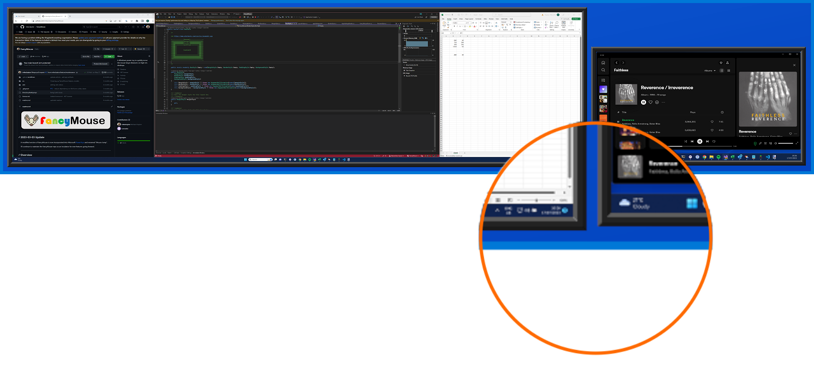

# Default V2 Config Sample

## Description

The **Default V2 Config** style places a thin, flat border around the main preview popup, and then adde a margin and border with a 3d effect to each screenshot to make it appear as if it's being displayed on a monitor bezel.

## Preview



## Config

The text below shows the config json used to display the above preview.

```json
{

  "version": 2,

  "hotkey": "CTRL + ALT + SHIFT + F",

  "preview": {
    "name": "default_v2",

    "size": {
      "width": 1600,
      "height": 1200
    },

    "canvas": {
      "border": {
        "color": "SystemColors.Highlight",
        "width": 6,
        "depth": 0
      },
      "padding": {
        "width": 6
      },
      "background": {
        "color1": "#0D57D2",
        "color2": "#0344C0"
      }
    },

    "screenshot": {
      "margin": {
        "width": 2
      },
      "border": {
        "color": "#222222",
        "width": 10,
        "depth": 3
      },
      "background": {
        "color1": "Color.MidnightBlue",
        "color2": "Color.MidnightBlue"
      }
    }

  }

}

```
