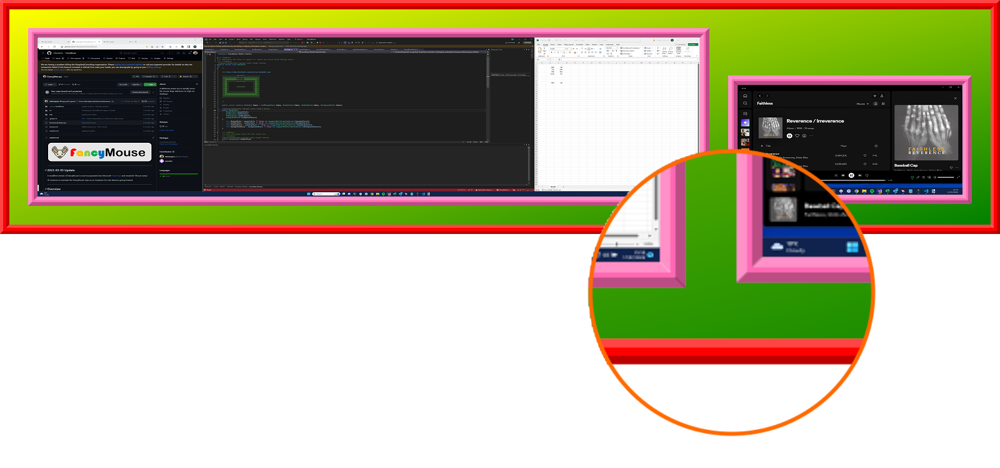

# Gaudy V2 Config Sample

## Description

As with any styling system, the FancyMouse config file can be abused to create some truly horrific visual appearances. This **Gaudy V2 Config** sample is one of them...

> Note this *might* actually be useful if you want to use FancyMouse as a kind of mouse-finder that shows an eye-catching popup on the screen where the mouse is located so it draws your eyes to it.

## Preview



## Config

The text below shows the config json used to display the above preview.

```json
{

  "version": 2,

  "hotkey": "CTRL + ALT + SHIFT + F",


  "preview": {
    "name": "gaudy_v2",

    "size": {
      "width": 1600,
      "height": 1200
    },

    "canvas": {
      "border": {
        "color": "Color.Red",
        "width": 15,
        "depth": 5
      },
      "padding": {
        "width": 15
      },
      "background": {
        "color1": "Color.Yellow",
        "color2": "Color.Green"
      }
    },

    "screenshot": {
      "margin": {
        "width": 15
      },
      "border": {
        "color": "Color.HotPink",
        "width": 15,
        "depth": 6
      },
      "background": {
        "color1": "Color.MidnightBlue",
        "color2": "Color.MidnightBlue"
      }
    }

  }

}

```
