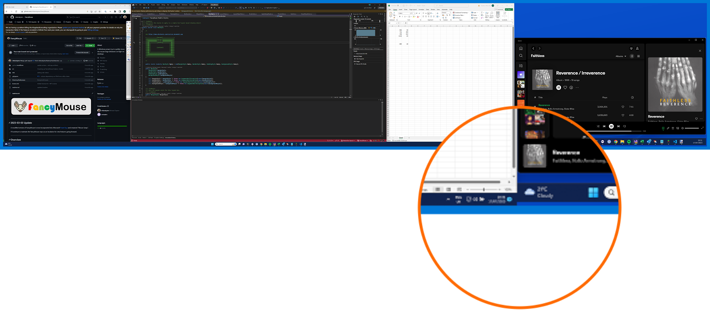

# Legacy V1 Config Sample

## Description

The **Legacy V1 Config** style can be simulated using the config file below. This places a thin, flat border around the main preview popup, and then clears all margin, border and padding settings on the screenshot box.

## Preview



## Config

The text below shows the config json used to display the above preview.

```json
{

  "version": 2,

  "hotkey": "CTRL + ALT + SHIFT + F",

  "preview_l": {
    "name": "legacy_v1",

    "size": {
      "width": 1600,
      "height": 1200
    },

    "canvas": {
      "border": {
        "color": "SystemColors.Highlight",
        "width": 7,
        "depth": 0
      },
      "padding": {
        "width": 0
      },
      "background": {
        "color1": "#0D57D2",
        "color2": "#0344C0"
      }
    },

    "screenshot": {
      "margin": {
        "width": 0
      },
      "border": {
        "color": "#222222",
        "width": 0,
        "depth": 0
      },
      "background": {
        "color1": "Color.MidnightBlue",
        "color2": "Color.MidnightBlue"
      }

    }

  }

}

```
